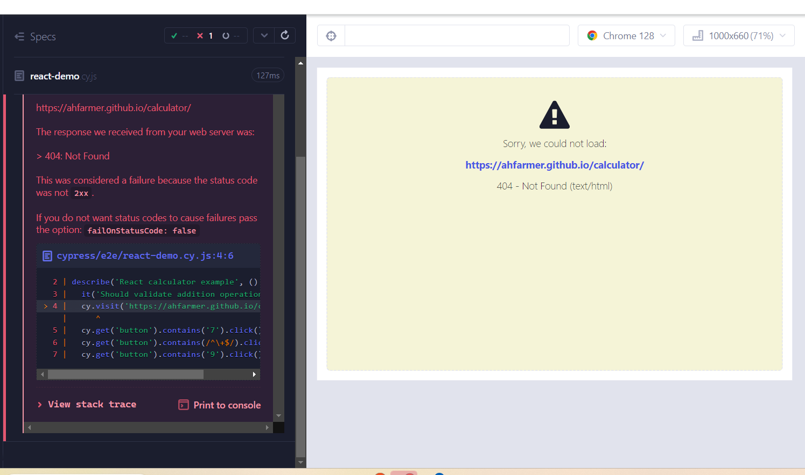

# Testando Aplicações React com Cypress

Este repositório contém o código e a documentação do tutorial ["How to Test React Using Cypress"](https://www.browserstack.com/guide/how-to-test-react-using-cypress). Abaixo estão os passos seguidos para configurar o Cypress, executar testes em uma aplicação React e ampliar o entendimento sobre técnicas de TDD (Desenvolvimento Orientado a Testes).

## Passos Seguidos

### 1. Inicializando o Projeto com npm

### 2. Instalando Cypress

### 3. Abrindo o Cypress

### 4. Escolhendo o tipo de teste E2E e suas configurações.

### 5. Escolhendo o Browser

### 6. Criando first spec

### 7. Rodando o spec

### 8. Execução dos testes

### 9. Terminal dos testes

### 10. Configuração do Novo Teste

### 11. Rodando a nova configuração de testes

### 12. Configuração teste da Calculadora

### 13. Execução testes calculadora

## Resultados dos Teste

1º Teste: Passou conforme esperado.
2º Teste: Falhou porque o site visitado apresentou problemas de funcionamento durante o teste.
3º Teste: Falhou devido a um erro 404 ao tentar acessar a URL.

Os testes demonstram como o Cypress pode ser utilizado para verificar o comportamento de aplicações React, seguindo práticas de TDD para garantir que as funcionalidades desenvolvidas atendam aos requisitos especificados.

## Conclusão
O uso do Cypress para testes em aplicações React é altamente recomendável, pois facilita a implementação de TDD com testes End-to-End eficientes e confiáveis. Ao seguir os passos descritos, conseguimos configurar, rodar e depurar testes que validam o funcionamento de nossa aplicação.